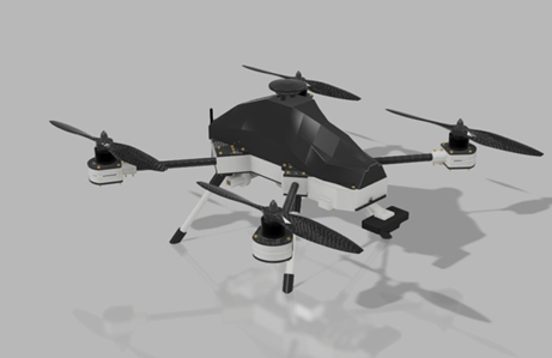
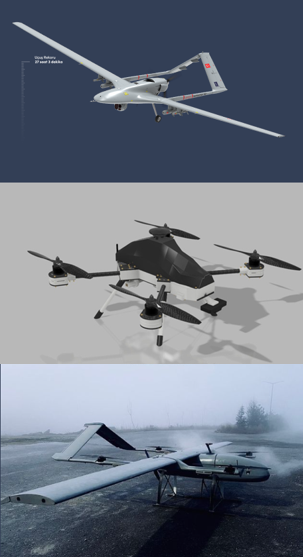

# 1. Giriş: İHA Nedir, Türleri ve Temel Alt Sistemler

Bu doküman, T3 Gemstone kartı kullanılarak bir İnsansız Hava Aracı
(İHA) tasarlamak ve inşa etmek isteyenler için hazırlanmış bir eğitim
ve başvuru kaynağıdır. Bu ilk bölümde İHA kavramını, İHA türlerini ve
bir İHA'yı oluşturan temel alt sistemleri tanıyacağız; ilerleyen
bölümlerde bu alt sistemlerin her birine (mekanik, aviyonik, yazılım)
ayrı ayrı ineceğiz.

## İHA Nedir?

İnsansız Hava Araçları (İHA), insan operatörünün doğrudan müdahalesi
olmadan otomatik olarak veya uzaktan kontrol edilen hava araçlarıdır.
İHA'lar, insanları veya yükleri taşıyabilecek, çeşitli görevleri yerine
getirebilecek ve geniş bir uygulama yelpazesine sahip olabilecek
şekilde tasarlanır.

  

### Kullanım Alanları

- Askeri Amaçlar
- Keşif ve Gözetleme
- Haritalama
- Tarım
- Acil Durum Yönetimi
- Kargo Taşımacılığı
- Arama Kurtarma Operasyonları

## İHA Türleri

  
   
  <em>Yukarıdan aşağıya: sabit kanat, döner kanat ve DİHA örnekleri.</em>

### Sabit Kanat

Geleneksel uçaklara benzer. Uzun süreli havada kalabilme, yüksek hız
ve geniş bir menzil gibi özelliklere sahiptir.

### Döner Kanat

Helikopterlerin avantajlarını taşır. Dikey kalkış ve iniş yetenekleri
sayesinde daha az alana ihtiyaç duyarlar ve sabit kanatlı uçaklara göre
daha fazla manevra kabiliyetine sahiptirler.

### DİHA

Bir hava aracının yerden dikey olarak kalkabilmesini ve yine dikey
olarak inebilmesini (VTOL — Vertical Take-Off and Landing) ifade eder.

## Model Seçimi: Neden Quadcopter?

Sabit kanat modeller uzun menzil ve yüksek süzülme verimliliği sağlar,
ancak dikey iniş-kalkış yapamaz. Döner kanat modeller ise helikopter ve
multirotor yapıdadır; olduğu yerde asılı kalabilir (hover) ve dikey
kalkış yapabilir.

Multirotor ailesi içinde Tricopter, Quadcopter, Hexacopter gibi
seçenekler bulunur. Bu dokümanda **Quadcopter** platformu esas
alınmıştır, çünkü maliyet, mekanik basitlik, denge ve kontrol kolaylığı
açısından ilk defa döner kanat bir araç tasarlayacaklar için en ideal
modeldir.

## İHA'nın Temel Alt Sistemleri

Bir İHA'yı hayata geçirmek, birbiriyle etkileşim hâlinde çalışan üç
temel alt sistemin bir araya gelmesiyle mümkün olur:

| Alt Sistem | Kapsam |
|---|---|
| **Mekanik** | Araç eksenleri, araç bileşenleri (gövde, kabuk, kol, iniş kızağı), itki kuvveti dengesi, aerodinamik, titreşim ve ağırlık merkezi |
| **Aviyonik** | İtki sistemi (motor, ESC, pervane), güç sistemi (batarya), otonom uçuş sistemi (otopilot kartı), haberleşme sistemi (telemetri, kumanda) |
| **Yazılım** | Yardımcı bilgisayar, sensör verisi işleme, kontrol döngüsü ve PID algoritması, otopilot yazılımı |

Bu üç alt sistem sırasıyla [02-mekanik-temelleri.md](02-mekanik-temelleri.md),
[03-aviyonik-ve-guc-sistemleri.md](03-aviyonik-ve-guc-sistemleri.md) ve
[04-yazilim-ve-kontrol-mantigi.md](04-yazilim-ve-kontrol-mantigi.md)
bölümlerinde ele alınmaktadır.

Devam etmek için [02-mekanik-temelleri.md](02-mekanik-temelleri.md).
