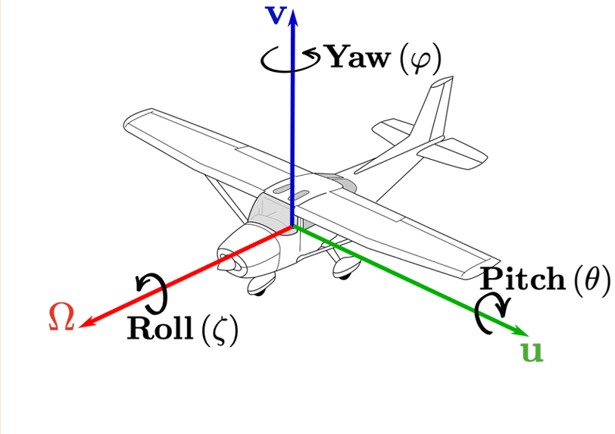
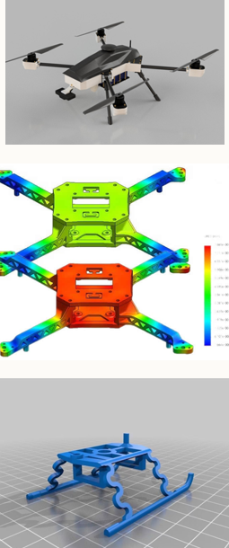
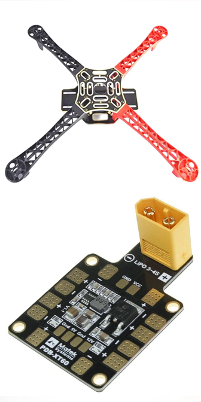
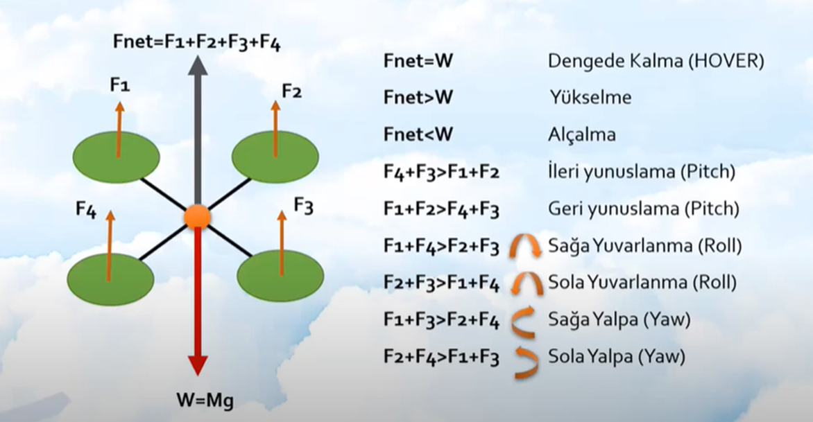
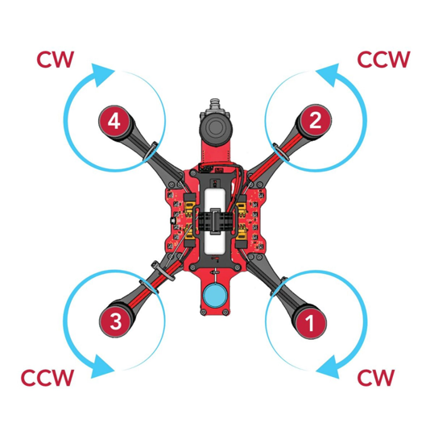
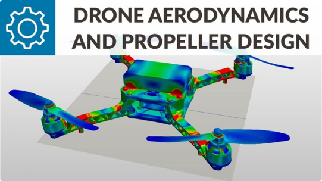

# 2. Mekanik Temeller

Bu bölüm, bir döner kanat İHA'nın (quadcopter) hareketini tanımlayan
eksenleri, fiziksel yapısını oluşturan bileşenleri, uçuşu mümkün kılan
itki-kuvvet dengesini ve tasarımda gözetilmesi gereken aerodinamik ve
titreşim etkenlerini ele alır.

## Araç Eksenleri

  

Bir hava aracının uzaydaki yönelimi, birbirine dik üç eksen etrafındaki
dönüşle tanımlanır:

**1. Yaw (Dönüş) Ekseni**
Aracın dikey eksine göre sağa ve sola dönmesini sağlar. Bu eksen
etrafında gerçekleşen dönüşler, aracın yönünü değiştirir.

**2. Pitch (Yüzey) Ekseni**
Aracın enlem eksenine göre yukarı ve aşağı hareketini kontrol eder.
Burnunun yukarı veya aşağı doğru yön değiştirmesini sağlar.

**3. Roll (Yan) Ekseni**
Aracın uzunlamasına eksenine göre sağa ve sola yatmasını kontrol eder.
Kanatların/kolların bir tarafını yukarı veya aşağı doğru döndürmesini
sağlar.

## Araç Bileşenleri (Döner Kanat)

  
  

**Şasi**
Aracın temel iskeletini oluşturur. Genel olarak ağırlığın büyük bir
çoğunluğu buraya biner.

**İniş Kızakları**
İnişte ve kalkışta aracın yerden yüksekliğini sağlar.

**Kabuk**
Aracın içindeki komponentleri korur.

**Kol**
Döner kanatta motor ile şasi arasındaki bağlantıyı sağlar.

**Gövde (Frame)**
Drone'un kemik yapısıdır; bütün parçalar bu iskelet üzerine monte
edilir. Hafiflik ve sağlamlık için genelde karbon fiber veya dayanıklı
plastik tercih edilir.

**PDB (Güç Dağıtım Kartı)**
Drone'un elektrik santralidir; pilden gelen yüksek voltajı güvenle
ESC'lere dağıtır. Aynı zamanda otopilot için 5V/12V gibi regüle
edilmiş temiz güç sağlar.

## Döner Kanat İtki Sistemi

  

Dört motorlu bir araçta, her motorun ürettiği itki kuvveti (F₁, F₂,
F₃, F₄) toplamı net itkiyi (Fnet) belirler. Fnet = F₁ + F₂ + F₃ + F₄.
Bu toplam kuvvet ile aracın ağırlığı (W = Mg) arasındaki ilişki,
aracın hareketini belirler:

| Durum | Sonuç |
|---|---|
| Fnet = W | Dengede Kalma (Hover) |
| Fnet > W | Yükselme |
| Fnet < W | Alçalma |

Motor kuvvetleri arasındaki farklar ise dönüş hareketlerini oluşturur:

| Kuvvet Dengesizliği | Hareket |
|---|---|
| F4+F3 > F1+F2 | İleri Yunuslama (Pitch) |
| F1+F2 > F4+F3 | Geri Yunuslama (Pitch) |
| F1+F4 > F2+F3 | Sağa Yuvarlanma (Roll) |
| F2+F3 > F1+F4 | Sola Yuvarlanma (Roll) |
| F1+F3 > F2+F4 | Sağa Yalpa (Yaw) |
| F2+F4 > F1+F3 | Sola Yalpa (Yaw) |

### Thrust-to-Weight Ratio (İtki - Ağırlık Oranı)

Bir aracın havalanabilmesi için ürettiği toplam itki kuvvetinin, toplam
ağırlığından büyük olması gerekir.

**Temel Kural:** Güvenli ve stabil uçuş için toplam itki, toplam
ağırlığın **en az 2 katı** olmalıdır.

**Örnek Hesaplama:** Toplam ağırlığı (pil, gövde, parçalar dahil) 1000
gram olan bir Quadcopter düşünelim. 4 motorun toplamda en az 2000 gram
itme kuvveti üretmesi gerekir; yani motor başına en az 500 gram itki
kapasitesi düşmelidir.

## Çapraz Dönüş Mantığı

  

**Neden tüm motorlar aynı yöne dönmez?**

Fizikteki "Aksiyon - Reaksiyon" (Tork) kuralı gereği, tüm motorlar aynı
yöne dönerse gövde ters yönde kendi etrafında sürekli döner.

**Çapraz Yön Dengesi:** Quadcopter'da çapraz duran motorlar aynı yöne
döner: iki motor saat yönünde (CW), iki motor saat yönünün tersinde
(CCW). Bu sayede tork kuvvetleri birbirini sıfırlar ve drone kendi
etrafında fırıldak gibi dönmeden sabit durabilir.

## Aerodinamik

**Kabuk ve Gövde Tasarımında Hava Akışı**
Profesyonel kabuk ve gövde (frame) tasarımında aerodinamik ilkeler ve
hava akışı doğrudan dikkate alınır.

**Pervane Akımı (Propeller Wash)**
Pervanenin havayı aşağı ittiği bölgedeki kollar çok geniş ve düz
olursa hava bu kollara çarpar ve ciddi bir itki kaybı yaşanır. Bu
yüzden kollar ince veya havayı yaracak damla kesitli (aerodinamik)
formda tasarlanır.

**Rüzgar Direnci (Drag)**
Drone ileri doğru hareket ederken yüzey alanı arttıkça rüzgar direnci
de artar. Kabuk tasarımları, hava sürtünmesini minimuma indirecek
şekilde akıcı hatlara sahip olacak şekilde modellenir.

## Titreşim ve Ağırlık Merkezi (CoG)

  

**Titreşim Analizi**
4 adet yüksek devirli motor ciddi bir titreşim üretir. Şasi esnek
olursa, bu titreşim sensörlerin yanlış veri göndermesine sebep olur.
Drone tasarımında bilgisayar ortamında stres testleri yapılarak
çerçevenin esnemeyecek kadar "rijit" (sert) olduğundan emin olunur.

**Ağırlık Merkezi (Center of Gravity - CoG)**
Bir drone'un ağırlık merkezi tam ortada olmalıdır. Pil veya kamera
biraz öne kayarsa ne olur? Öndeki motorlar drone'u düz tutmak için
sürekli daha fazla çalışır. Bu motorlar aşırı ısınır, denge bozulur ve
pil çok daha hızlı biter.

---

Devam etmek için [03-aviyonik-ve-guc-sistemleri.md](03-aviyonik-ve-guc-sistemleri.md).
