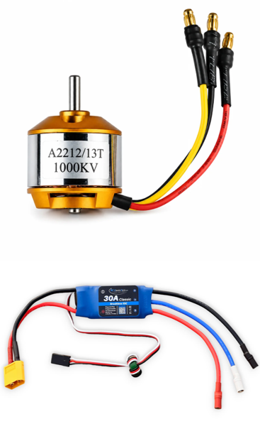
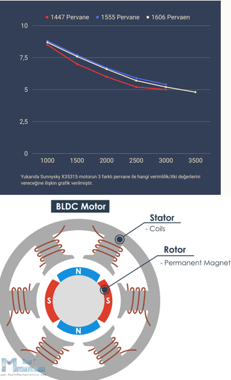
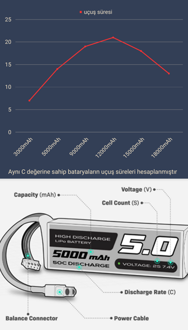
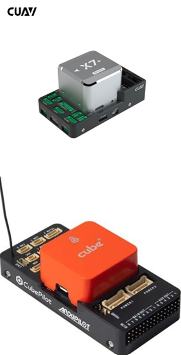
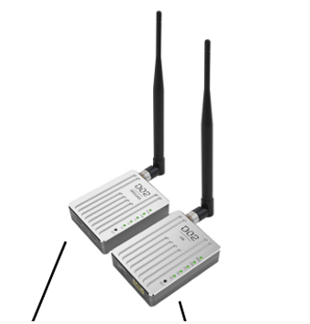
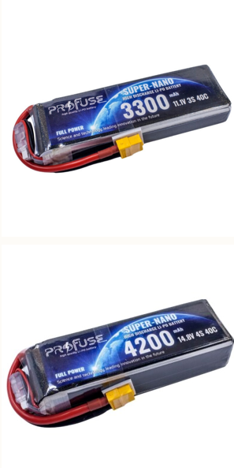

# 3. Aviyonik ve Güç Sistemleri

Aviyonik, bir İHA'yı kontrol eden elektronik sistemlerin bütünüdür.
Bu bölümde dört temel aviyonik alt sistemini — itki, güç, otonom uçuş
ve haberleşme — ve bu sistemlerin tasarımında kullanılan hesaplamaları
ele alıyoruz.

## İtki Sistemi

<p align="center">
  
  
</p>

### Motor ve ESC Seçimi

İHA'larda fırçasız elektrikli motorlar (BLDC) kullanılır; uzun ömürlü
ve düşük tolerans avantajı sağlarlar. Fırçasız motorlar doğrudan pil
takılarak çalışmaz, özel bir sürücüye ihtiyaç duyarlar. ESC (Elektronik
Hız Kontrolcüsü), motorların otopilotla konuşma dilidir: otopilottan
aldığı sinyallere göre motora ne kadar güç ve kaç devir vereceğini
anlık olarak ayarlar; her motor için 1 adet ESC kullanılır.

### Pervane Seçimi

Pervaneler, motorun dönme gücünü itme kuvvetine (thrust) dönüştürerek
drone'u havada tutar; CW (saat yönü) ve CCW (saat yönünün tersi) olarak
çift halinde çalışırlar. Araçta kullanılacak motor ve pervane birlikte
seçilir; düzgün kombinasyonlar istenilen itki değerlerini verir.

### KV Değeri

KV, yalnızca fırçasız motorlar için geçerli devir katsayısıdır. 1 Volt
için 1 dakikada kaç devir çevireceğini belirtir.

```
KV = RPM / Volt
```

**Örnek:** 1200 KV'lik bir motora 11.1V verilirse dakikada 13320 devir
(RPM) çevirir.

## Güç Sistemi

<p align="center">
  
</p>

Batarya seçimi; güç ihtiyacı, uçuş süresi, ağırlık ve güvenlik
faktörlerine göre yapılır.

**Seri Bağlı Hücre Sayısı (S)**
Motorun ve ESC'nin kaç S Li-Po desteklediğine bakılır. Bir hücre
nominal 3.7V'tur, tam dolu hücre 4.2V gerilime sahiptir.

**mAh Değeri**
Bataryanın 1 saatte kaç miliamper akım sağlayabildiği bilgisini verir.
Uçuş süresine direkt etki eder.

**C Değeri (Deşarj Oranı)**
Bataryanın ne kadar hızlı deşarj olabildiğini gösterir. Bu katsayı göz
ardı edilirse batarya motorun anlık akım talebini karşılayamayabilir.

```
Pilden anlık çekilebilecek akım = C × mAh
```

## Otonom Uçuş Sistemi

<p align="center">
  
</p>

**Otopilot Uçuş Kartı (FC):** İHA'nın otonom veya yarı otonom uçuş
yeteneklerini kontrol etmek ve yönetmek için kullanılan elektronik
kontrol birimidir. İHA'nın beyni olarak düşünülebilir. İçerisinde
bulunan sensörler; jiroskoplar, ivmeölçerler, basınç sensörleri ve
manyetometreler ve GPS gibi navigasyon bileşenleridir.

Bu sensörler, İHA'nın konumunu, hızını, yüksekliğini ve yönelimini
belirleyerek uçuş kontrolünü sağlar.

## Haberleşme Sistemi

<p align="center">
  
</p>

**Telemetri:** İHA'nın uçuş sırasında veri alışverişi yapmasını
sağlayan iletişim sistemidir. İHA, sensörler aracılığıyla uçuş
verilerini toplar ve telemetri üzerinden kablosuz olarak kontrol
merkezine aktarır. Kontrol merkezi verileri analiz eder, durumu
değerlendirir ve İHA'ya komutlar göndererek uçuşun kontrolünü sağlar.

**Kumanda (Tx/Rx):** Pilotun komutlarını otopilota iletir. Genelde bir
adet alıcı, kumandanın kendisi ve vericiden oluşur. Paket halinde
satılır, ayrı ayrı da alınabilir.

## Güç ve İtki Hesaplamaları

Aşağıdaki örnekler, teorik bilgiyi somut bir aracın parça seçimine
dönüştürürken karşılaşılacak hesaplamaları göstermektedir.

### Hücre Sayısı ve Akım

<p align="center">
  
</p>

Volt (V) ve gaz (throttle) seviyesine göre motorun çektiği Amper (A)
ve ürettiği İtki (Thrust) değerleri, motorun teknik veri tablosundan
analiz edilir.

**Örnek:** 11.1V (3S) batarya ile %50 gazda ~20W güç çekilirken,
14.8V (4S) seviyesinde verimlilik ve itki değerleri değişir.

- **Düşük Akım, Yüksek Verim (4S):** Sistem aynı gücü üretmek için
  daha düşük Amper çeker. Bu sayede ESC ve motorlar daha az ısınır.
- **Yüksek Devir (RPM) ve İtki:** Artan voltaj, motorların daha yüksek
  devire ulaşmasını sağlar. Bu da pervanelerin daha fazla itmesine
  (thrust) yol açar.
- **Güvenlik ve İtki Limitleri:** Sistemin toplam ağırlığı arttığında,
  3S batarya "Ağırlık × 2" itki kuralını karşılarken zorlanır ve anlık
  voltaj sağımı (voltage sag) yaşatır. 4S sistemi yakmadan güvenli
  performans sunar.

### Ağırlık ve İtki Dengesi

**Temel Kural:** Motorların Toplam İtki Gücü = Toplam Kalkış Ağırlığı × 2

**Örnek Hesaplama:**

```
Toplam İtki = 860 gr × 4 = 3440 gr
3440 gr = (Pil Ağırlığı + 1300 gr) × 2
Maksimum Pil Ağırlığı = 420 gr
```

### Hover Süresi ve C Değeri

**Hover Süresi Hesaplama:**

```
Pil Akım Kapasitesi = 6 Ah × 60 = 360 A/dk
Kullanılabilir Kapasite (%80) = 360 × 0.80 = 288 A/dk
Motorların Toplam Akımı = 5 A × 4 = 20 A
Tahmini Hover Süresi = 288 / 20 = 14,4 dk
```

**Anlık Amper Limiti:**

```
Pilden Çekilebilecek Anlık Akım = Ah × C
```

---

Devam etmek için [04-yazilim-ve-kontrol-mantigi.md](04-yazilim-ve-kontrol-mantigi.md).
