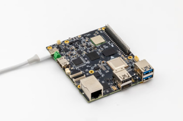
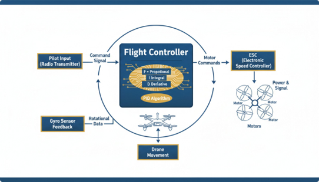
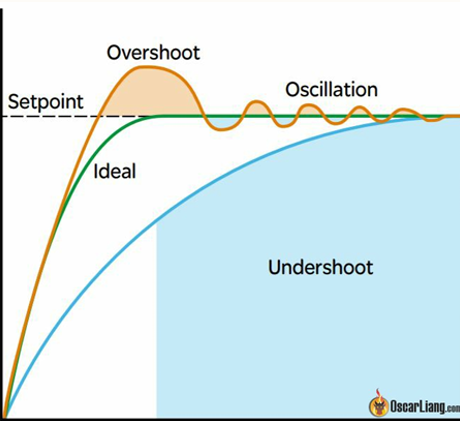
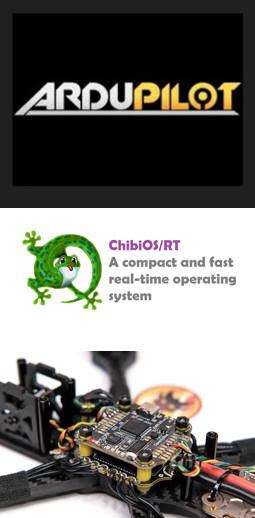

# 4. Yazılım ve Kontrol Mantığı

Bir İHA'nın havada stabil kalabilmesi, sensörlerden gelen verinin
saniyede yüzlerce kez işlenip motorlara komut olarak geri dönmesiyle
mümkün olur. Bu bölümde bu döngünün mantığını, PID algoritmasını ve
görevi üstlenen yazılım bileşenlerini ele alıyoruz.

## Yardımcı Bilgisayar

  

Ana bilgisayar (uçuş kartı) yanında veya onunla birlikte çalışan,
belirli görevleri yerine getiren bir bilgisayar sistemidir. Daha güçlü
bir işlemciye, belleğe ve depolama kapasitesine sahiptir. Robotik,
görüntü işleme, yapay zeka ve derin öğrenme projelerinde sıklıkla
kullanılır.

Kameralar, ekranlar gibi çevre birimleriyle iletişim kurarak ana
bilgisayarın (otopilotun) yükünü hafifletir ve otopilotun daha spesifik
görevlere odaklanmasını sağlar.

## Sensör Verileri ve Temel Kontrol Döngüsü

  

**Sensör Verileri (IMU — Jiroskop, İvmeölçer)**

Kodlama mantığının temeli "şu an hangi açıdayım?" sorusuna yanıt
almaktır. İvmeölçer yerçekimi yönünü (açıyı) ölçerken, jiroskop ise
açısal dönme hızını ölçer.

**Temel Kontrol Döngüsü**

1. Sensörden açıyı oku (Örn: Drone sağa 5 derece yatmış).
2. Kumandadan gelen hedef açıyla karşılaştır.
3. Farkı düzeltmek için ilgili motorların hızını artır/azalt; bu
   döngüyü saniyede yüzlerce kez tekrar et.

Bu akışta uçuş kartı (Flight Controller), pilot komutunu (kumandadan
gelen komut sinyalini) ve jiroskop sensöründen gelen dönme (rotasyon)
verisini birlikte değerlendirerek motor komutlarını üretir; bu
komutlar ESC üzerinden motorlara güç ve sinyal olarak iletilir.

## PID Algoritması

  

**PID (Proportional-Integral-Derivative):** Geri beslemeli sistemleri
istenen hedef değere en hızlı ve kararlı şekilde yönlendirmek için
yaygın olarak kullanılan bir yöntemdir. Drone'un havada titremeden,
rüzgara rağmen stabil kalmasını sağlayan matematiksel algoritmadır.

**Oransal (P — Proportional)**
Hedef ile mevcut değer arasındaki farka dayalı kontrol sinyali
hesaplar. Mevcut hataya bakar; hata ne kadar büyükse motorlara o kadar
sert tepki verir.

**İntegral (I)**
Zamanla biriken hata miktarını hesaplar ve sistem stabilitesini
artırır. Geçmişteki birikmiş hatalara bakar; sürekli dış etkenlerin
sürüklemesini engeller.

**Türev (D — Derivative)**
Hedefe ulaşma hızını düzenler, aşırı salınımları (overshoot) azaltır.
Gelecekteki değişim hızına bakar; hedefe yaklaşırken frenleme yaparak
aşırı sallanmayı (overshoot) önler.

Doğru PID ayarı; istenen tepkiyi sağlar ve kararlılığı artırır.
Arduino veya otopilot yazılımlarında bu 3 parametre ayarlanarak stabil
uçuş elde edilir.

## Otopilot Yazılımları

  

**ArduPilot Nedir?**
Çok pervaneli drone'lar dahil birçok araç türünü destekleyen, güvenilir
ve açık kaynaklı bir otopilot sistemidir.

**ChibiOS Nedir?**
Gömülü uygulamalar için geliştirilmiş, yüksek performanslı Gerçek
Zamanlı İşletim Sistemi (RTOS) platformudur.

**Sistemdeki Rolleri**

ChibiOS uçuş kartına işletim sistemi olarak yüklenir; ArduPilot gibi
uygulamaların uçuş kartının üzerinde doğru çalıştığından emin olunur.
ArduPilot işletim sisteminin ardından uçuş kartına yüklenir ve otonom
uçuşu sağlayan ana yazılım (firmware) olur.

T3 Gemstone O1 kartı üzerinde ArduPilot'un nasıl çalıştırıldığına dair
somut bir örnek için
[06-t3-gemstone-o1-mimarisi.md](06-t3-gemstone-o1-mimarisi.md)
bölümüne bakınız.

---

Devam etmek için [05-parca-secimi-montaj-ve-tasarim-sureci.md](05-parca-secimi-montaj-ve-tasarim-sureci.md).
