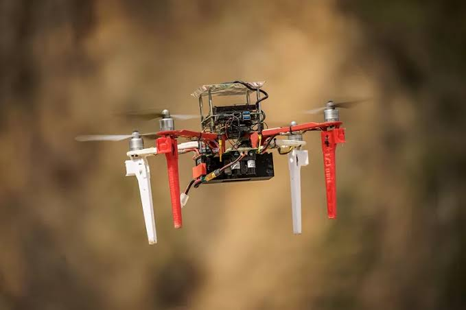
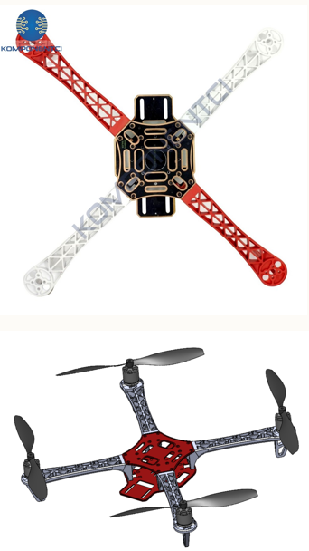

# 5. Parça Seçimi, Montaj ve Tasarım Süreci

Önceki bölümlerde teorik temelleri gördük. Bu bölüm, bu bilgiyi bir
araç inşa etmeye dönüştürürken izlenecek pratik akışı ele alır:
parçaların doğru sırayla nasıl seçileceği, birbirine nasıl
bağlanacağı ve bir aracın tasarım sürecinin baştan sona hangi
adımlardan geçtiği.

## Malzeme Seçimi ve Parçaların Uyumu

### Seçime Nereden Başlanır?

Seçim noktası, aracın amacına göre değişir:

- **Ağır Yük / Kargo Drone'ları:** Belirli bir ağırlığı taşıması
  gerektiği için seçime İtki / Motor ve Pervaneden başlanır; ardından
  bu devasa pervanelerin sığacağı gövde seçilir.
- **Standart / Hobi Drone'ları:** Sınırları belirlemek için seçime
  Gövde (Frame) ile başlanır. Gövde boyutu takılabilecek maksimum
  pervane çapını belirler.

### Adım Adım Parça Eşleştirme Zinciri

1. **Gövde & Pervane:** Gövde boyutuna uygun maksimum pervane çapı
   seçilir.
2. **Motor:** Pervane ile uyumlu olup olmadığını anlamak için
   seçilecek motorun teknik veri tablosu (datasheet) incelenir.
3. **ESC:** Motorun %100 gazda çektiği maksimum akımın en az %20-%30
   üzerinde akım veren bir ESC seçilir.
4. **Pil (LiPo):** Motor ve ESC'nin voltaj ile akım ihtiyacını
   karşılayacak pil seçilir.
5. **PDB:** Pilden gelen yüksek akımı güvenle taşıyacak Amper
   kapasitesine ve otopilot/sensörler için gerekli 5V/12V BEC
   (Regülatör) çıkışlarına sahip PDB tercih edilir.

## Parçaları Birleştirme ve Bağlantı Elemanları

  

### Lehimleme (Elektronik Bağlantılar)

Motor-ESC, ESC-PDB ve pil kablosu gibi yüksek akım geçen ana hatlar
yüksek ısıya dayanıklı lehim ile birleştirilir. Açıkta kalan lehim
noktaları kısa devreyi önlemek için Makaron (Heat Shrink) ile izole
edilir.

### Fiziksel Sabitleme (Mekanik)

Otopilotu titreşimden korumak için Plastik Somun/Yükselticiler
(Standoff) ve Silikon Damperler kullanılır. Kablo dağınıklığını
önlemek ve gövdeye sabitlemek için Cırt Kelepçe (Zip Tie) ve Çift
Taraflı Köpük Bant/Silikon tercih edilir.

### Sinyal ve Veri Bağlantıları (Plug / Cable)

Otopilot ile alıcı (Rx), ESC sinyal hatları ve sensörler arasındaki
düşük voltajlı veri iletimi için JST, Molex soketler ve dişi-erkek
Jumper kablolar kullanılır.

### Devre Kesici ve Güvenlik

Ağır endüstriyel şalterler yerine; ilk güç vermede kısa devre
oluşursa kartların yanmasını önleyen Smoke Stopper (Sigortalı Test
Soketi) ve bataryayı takarken kıvılcım çıkmasını engelleyen Anti-Spark
XT60 Soketleri kullanılır.

## Araç Tasarımı Süreci

Bir İHA'nın sıfırdan tasarımı, aşağıdaki adımları sırasıyla izler:

1. **Görevi Tanımlama:** İlk adım, İHA'nın ne için kullanılacağını
   belirlemektir. Hangi tür yük taşıması gerekecek? Hangi menzil ve
   dayanıklılık gereksinimleri var?
2. **Platform Seçimi:** Birçok farklı türde döner kanatlı platform
   mevcuttur ve her birinin avantajları ve dezavantajları vardır.
   Platform, görev gereksinimlerine dayalı olarak seçilmelidir.
3. **Aviyonik Tasarımı:** Aviyonik, İHA'yı kontrol eden elektronik
   sistemleri içerir. Bunlar uçuş kontrol sistemi, navigasyon sistemi
   ve iletişim sistemini içerir.
4. **Hava Aracı & Gövde Tasarımı:** İHA'nın gövdesi, taşıyabileceği
   yük ve yakıt ağırlığını destekleyecek kadar yeterince güçlü olmalı
   ve aerodinamik olarak verimli olmalıdır.
5. **Güç ve İtki Sistemi:** Seçilen itki sistemi, İHA'nın boyutunu ve
   ağırlığını görev gereksinimlerine bağlı olacaktır.
6. **Analiz ve Hesaplamalar:** Belirli analiz programları üzerinden
   aracın Fluent analizlerini gerçekleştirilebilir.
7. **İnşa ve Entegrasyon:** Tasarım tamamlandıktan sonra, İHA inşa
   edilebilir. Bu süreç, aracın montajını, itiş sistemini kurmayı ve
   aviyonikleri entegre etmeyi içerir.
8. **Test ve Göreve Başlama:** İHA test edildikten ve onaylandıktan
   sonra, göreve başlanabilir.

## Platform Seçimi Örneği

  

Proje ölçeğine, bütçeye ve ihtiyaçlara göre farklı gövde ve pervane
kombinasyonları tercih edilebilir. Başlangıç seviyesindeki projeler ve
temel modüler kurulumlar için aşağıdaki bileşenler oldukça uygundur:

- **Gövde Kit (Frame):** F450 Gövde Kiti Kırmızı/Beyaz
- **Pervane Seti:** 1045 Drone Pervanesi - CW/CCW Seti Siyah

Bu platform; modüler yapısı, kolay montajı ve yedek parça
erişilebilirliği sayesinde ilk defa drone montajı yapacaklar ve temel
düzeydeki projeler için ideal bir altyapı sunar.

---

Devam etmek için
[06-t3-gemstone-o1-mimarisi.md](06-t3-gemstone-o1-mimarisi.md).
