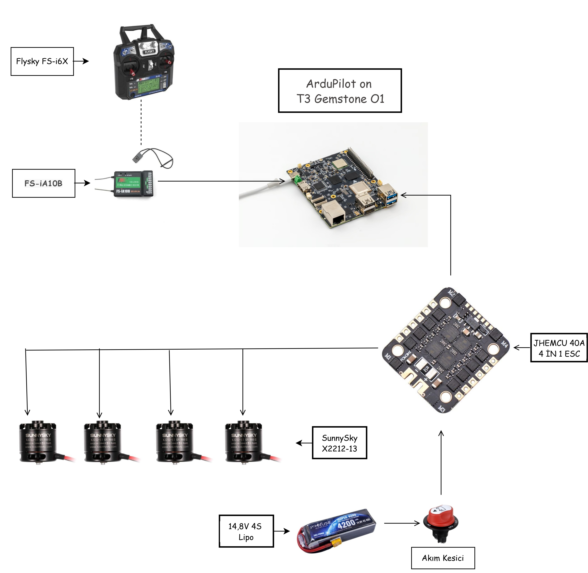

# 6. T3 Gemstone O1 ile Aviyonik Mimarisi ve Örnek Yapılandırmalar

Önceki bölümlerde genel İHA teorisini gördük. Bu bölümde, bu teoriyi
somut bir donanım seçimine indirgiyoruz: T3 Gemstone O1 kartının bir
İHA'nın otopilot kartı olarak nasıl konumlandığını ve bu karta uygun
iki farklı aviyonik yapılandırmayı ele alıyoruz.

T3 Gemstone O1'in kart kurulumu (imaj yazma, ilk açılış vb.) bu
dokümanın kapsamı dışındadır; bunun için T3'ün resmi dokümantasyonuna
bakınız: [docs.t3gemstone.org](https://docs.t3gemstone.org).

## Aviyonik Sistem Mimarisi

Aviyonik sistem mimarisinde ihtiyaçlara ve performans beklentilerine
göre farklı bileşen konfigürasyonları kullanılabilir. Bu projede
esas alınan temel sistem bileşenleri şunlardır:

| Bileşen | Seçim |
|---|---|
| Uçuş Kontrolcüsü | T3 Gemstone O1 |
| Kumanda & Alıcı | Flysky FS-i6X & FS-iA10B |
| Güç Dağıtımı & ESC | Bireysel 30A ESC'ler + Matek PDB veya 4'ü 1 arada (4in1) ESC çözümleri |
| Motorlar | A2212 veya SunnySky X2212 serisi fırçasız motorlar |
| Batarya & Güvenlik | 3S / 4S Li-Po Batarya ve Emniyet Akım Kesici |
| Otopilot Kartı | T3 Gemstone O1 & ArduPilot |
| Otopilot Yazılımı | Farklı araç türlerini destekleyen, gelişmiş ve açık kaynaklı ArduPilot altyapısı |
| Entegre Sensör Desteği | Kart üzerinde dahili IMU, pusula, barometre |

## Otopilot Kartı: T3 Gemstone O1 & ArduPilot

  

T3 Gemstone O1, üzerinde ArduPilot çalıştırılarak farklı araç
türlerini destekleyen, gelişmiş ve açık kaynaklı bir otopilot altyapısı
oluşturur.

### Entegre Sensör Desteği

- **IMU (Atalet Ölçüm Birimi):** InvenSense ICM-20948 (SPI arayüzü) ile
  hassas konum/yönelim takibi.
- **Pusula & Barometre:** Dahili AK09916 manyetometre ve yüksek
  hassasiyetli LPS22DFTR yükseklik sensörü.
- **Güç ve Batarya İzleme:** ADS1115 (16-bit ADC) entegresi ile 4
  kanallı anlık voltaj ve akım takibi.

### Haberleşme ve Çevre Birimleri

- **CAN Bus:** Güvenilir veri iletimi için TCAN1462-Q1 sürücüsü.
- **GPS & RC:** UART üzerinden GPS ve SBUS kumanda alıcı bağlantısı.
- **Motor/Servo Kontrolü:** 7 adet donanımsal PWM çıkışı.

> **Not:** Bu bölümdeki sensör ve arayüz bilgileri, kartın genel
> donanım yeteneklerini özetler. GPIO pin haritası ve fiziksel
> bağlantı detayları projeye özgüdür ve her kartta `gpiodetect` /
> `gpioinfo` ile doğrulanmalıdır.

## Örnek Yapılandırmalar

İlk tasarımımız giriş seviyesi için erişilebilir bir altyapı
oluştururken, ikinci tasarımımız biraz daha gelişmiş donanımlarla daha
kararlı bir kontrol altyapısı oluşturmaktadır.

### Tasarım 1 (Giriş Seviyesi)

  

| Bileşen | Seçim |
|---|---|
| Motor | EMAX Multicopter motoru MT2213 (Prop1045 Combo ile), 935KV CCW |
| ESC | JHEMCU 40A 4İN1 ESC 2-6S EM-40A |
| Pervane | 1045 Drone Pervanesi - CW/CCW Seti Siyah |
| Kablo (Kırmızı/Siyah) | 12 AWG Silikon Kablo - 1 Metre |
| Plug | XT60 Dişi/Erkek Konnektör Takımı |
| Alıcı + Kumanda | Flysky FS-i6X 2.4GHz 10 Kanal Kumanda + FS-iA10B Alıcı |
| Frame (örnek) | F450 Gövde Kiti Kırmızı/Beyaz |
| Lipo | 11.1V 3S Lipo Batarya 3300 mAh 40C |
| Banana Plug | 4mm Banana Bullet Plug Çifti |
| Kamera | Raspberry Pi Camera Modül V2 - New Model |

### Tasarım 2 (Gelişmiş Seviye)

  

| Bileşen | Seçim |
|---|---|
| Motor | SunnySky X2212-13 980KV Fırçasız RC Uçak ve Drone Motoru |
| ESC | JHEMCU 40A 4İN1 ESC 2-6S EM-40A |
| Pervane | 1045 Drone Pervanesi - CW/CCW Seti Siyah |
| Akım Kesici | Aksa Mini Devre Kesici / Akü Şalter (100-500A) |
| Kablo (Kırmızı/Siyah) | 12 AWG Silikon Kablo - 1 Metre |
| Plug | XT60 Dişi/Erkek Konnektör Takımı |
| Alıcı + Kumanda | Flysky FS-i6X 2.4GHz 10 Kanal Kumanda + FS-iA10B Alıcı |
| Frame | F450 Gövde Kiti Kırmızı/Beyaz |
| Lipo | 14,8V 4S 4200mAh 40C Lipo Batarya |
| Banana Plug | 4mm Banana Bullet Plug Çifti |

İki tasarım arasındaki temel fark, batarya hücre sayısı (3S / 4S) ve
motor seçimidir; bu farkın güç, verim ve itki üzerindeki etkisi için
[03-aviyonik-ve-guc-sistemleri.md](03-aviyonik-ve-guc-sistemleri.md)
bölümündeki "Hücre Sayısı ve Akım" başlığına bakınız.

## İleri Seviye Eklentiler

Temel mekanik ve temel kodlama mantığını oturttuktan sonra drone'a
eklenebilecek ileri seviye modüller:

**GPS Modülü**
Otonom uçuş, konum sabitleme ve eve dönüş (Return-to-Home)
fonksiyonları için.

**FPV Kamera & Verici**
Canlı görüntü aktarımı ve gözlükle uçuş deneyimi için.

**Telemetri / Lidar / Ultrasonik Sensörler**
Yerden yükseklik sabitleme, engel tanıma ve anlık uçuş verilerini
bilgisayara aktarma için.

---

Devam etmek için [07-kaynakca.md](07-kaynakca.md).
