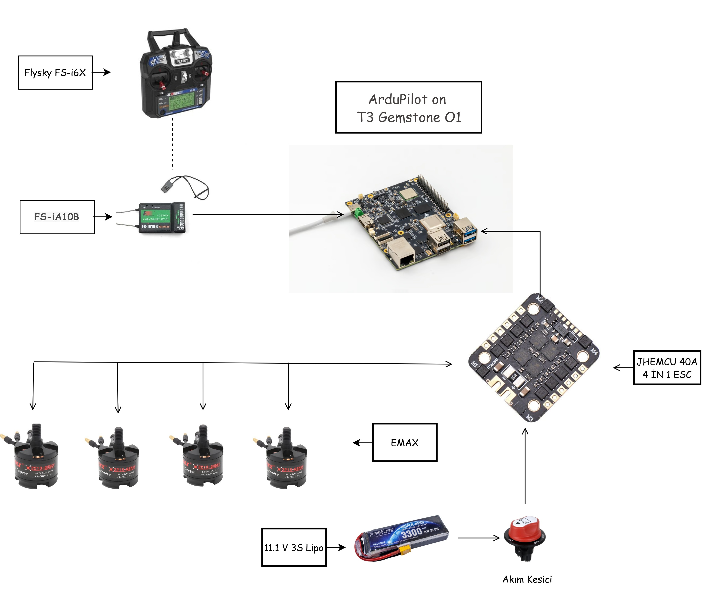

# 7. Örnek Yapılandırmalar ve İleri Seviye Eklentiler

Önceki bölümde T3 Gemstone O1'in aviyonik mimarisini gördük. Bu
bölümde, bu mimariyi temel alan iki somut parça listesini (BOM) ve
temel yapı tamamlandıktan sonra eklenebilecek ileri seviye modülleri
ele alıyoruz.

## Örnek Yapılandırmalar

İlk tasarımımız giriş seviyesi için erişilebilir bir altyapı
oluştururken, ikinci tasarımımız biraz daha gelişmiş donanımlarla daha
kararlı bir kontrol altyapısı oluşturmaktadır.

### Tasarım 1 (Giriş Seviyesi)

  

| Bileşen | Seçim |
|---|---|
| Motor | EMAX Multicopter motoru MT2213 (Prop1045 Combo ile), 935KV CCW |
| ESC | JHEMCU 40A 4İN1 ESC 2-6S EM-40A |
| Pervane | 1045 Drone Pervanesi - CW/CCW Seti Siyah |
| Kablo (Kırmızı/Siyah) | 12 AWG Silikon Kablo - 1 Metre |
| Plug | XT60 Dişi/Erkek Konnektör Takımı |
| Alıcı + Kumanda | Flysky FS-i6X 2.4GHz 10 Kanal Kumanda + FS-iA10B Alıcı |
| Frame (örnek) | F450 Gövde Kiti Kırmızı/Beyaz |
| Lipo | 11.1V 3S Lipo Batarya 3300 mAh 40C |
| Banana Plug | 4mm Banana Bullet Plug Çifti |
| Kamera | Raspberry Pi Camera Modül V2 - New Model |

### Tasarım 2 (Gelişmiş Seviye)

  

| Bileşen | Seçim |
|---|---|
| Motor | SunnySky X2212-13 980KV Fırçasız RC Uçak ve Drone Motoru |
| ESC | JHEMCU 40A 4İN1 ESC 2-6S EM-40A |
| Pervane | 1045 Drone Pervanesi - CW/CCW Seti Siyah |
| Akım Kesici | Aksa Mini Devre Kesici / Akü Şalter (100-500A) |
| Kablo (Kırmızı/Siyah) | 12 AWG Silikon Kablo - 1 Metre |
| Plug | XT60 Dişi/Erkek Konnektör Takımı |
| Alıcı + Kumanda | Flysky FS-i6X 2.4GHz 10 Kanal Kumanda + FS-iA10B Alıcı |
| Frame | F450 Gövde Kiti Kırmızı/Beyaz |
| Lipo | 14,8V 4S 4200mAh 40C Lipo Batarya |
| Banana Plug | 4mm Banana Bullet Plug Çifti |

İki tasarım arasındaki temel fark, batarya hücre sayısı (3S / 4S) ve
motor seçimidir; bu farkın güç, verim ve itki üzerindeki etkisi için
[03-aviyonik-ve-guc-sistemleri.md](03-aviyonik-ve-guc-sistemleri.md)
bölümündeki "Hücre Sayısı ve Akım" başlığına bakınız.

## İleri Seviye Eklentiler

Temel mekanik ve temel kodlama mantığını oturttuktan sonra drone'a
eklenebilecek ileri seviye modüller:

**GPS Modülü**
Otonom uçuş, konum sabitleme ve eve dönüş (Return-to-Home)
fonksiyonları için.

**FPV Kamera & Verici**
Canlı görüntü aktarımı ve gözlükle uçuş deneyimi için.

**Telemetri / Lidar / Ultrasonik Sensörler**
Yerden yükseklik sabitleme, engel tanıma ve anlık uçuş verilerini
bilgisayara aktarma için.

---

Devam etmek için [08-kaynakca.md](08-kaynakca.md).
